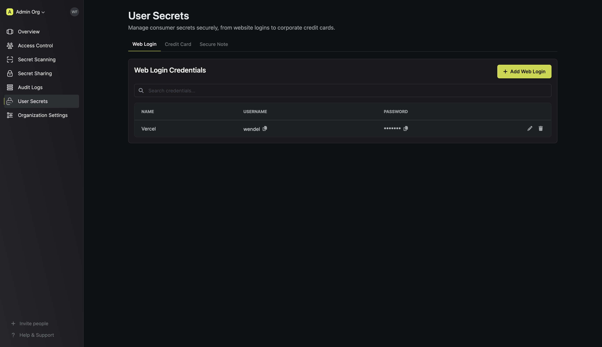
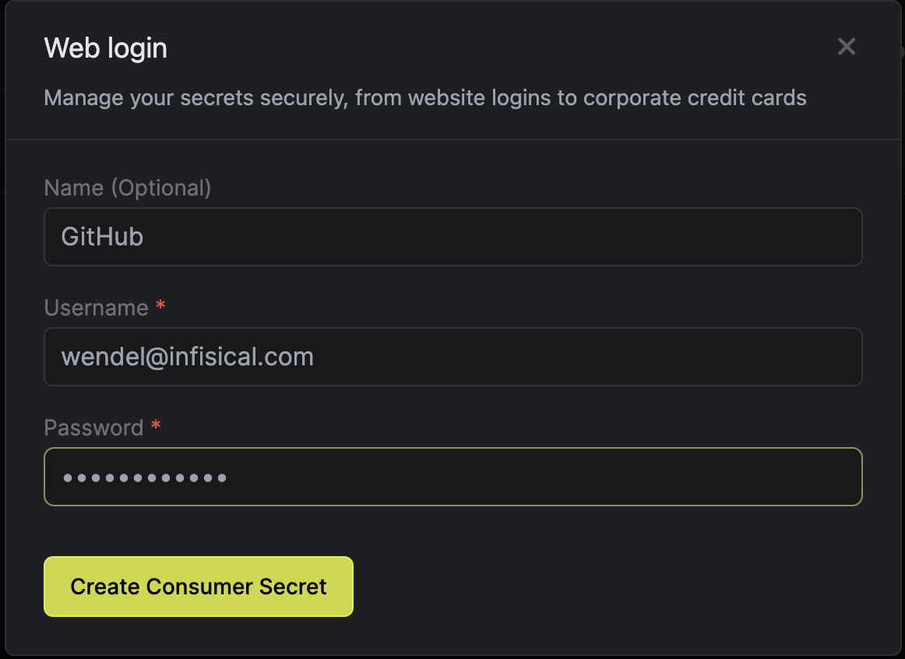

Infisical's Consumer Secrets Management feature is designed to help teams securely store and share sensitive consumer-related information—such as login credentials, credit card details, software licenses, and other confidential data. This feature builds on Infisical’s robust application secrets management and extends it to a broader range of secrets, helping businesses securely manage and share both infrastructure and consumer secrets.

With a zero-knowledge architecture, Infisical ensures that sensitive data remains unreadable even to its own systems, protecting your secrets from unauthorized access.

## Create a Consumer Secret

1. Navigate to the **Organization** page.
2. Click on the **User Secrets** tab from the sidebar.

<Note>
    Infisical does not have access to the consumer secrets. This is a part of
    our zero knowledge architecture.
</Note>

3. Click on the tab for the type of secret you want to create, then fill in the required fields.

Consumer Secrets Management provides a central location to store a variety of sensitive information types, such as:

-   Website Logins: Store and share website credentials securely.
-   Corporate Credit Card Information: Safeguard payment details used by team members.
-   Social Media Credentials: Manage shared social media access credentials without risk.
-   Software Licenses: Securely store software license keys used across the organization.
-   Other Confidential Information: Capture and manage any other sensitive information as needed.

    

## Delete a Consumer Secret

In the **User Secrets** page, click on the **Delete** button next to the secret you want to delete. This will delete the secret immediately.
